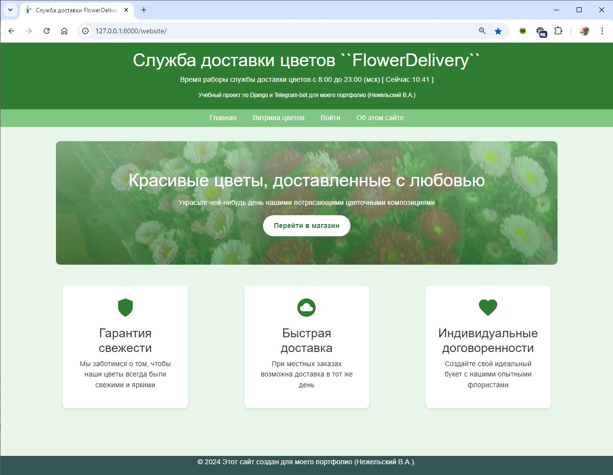
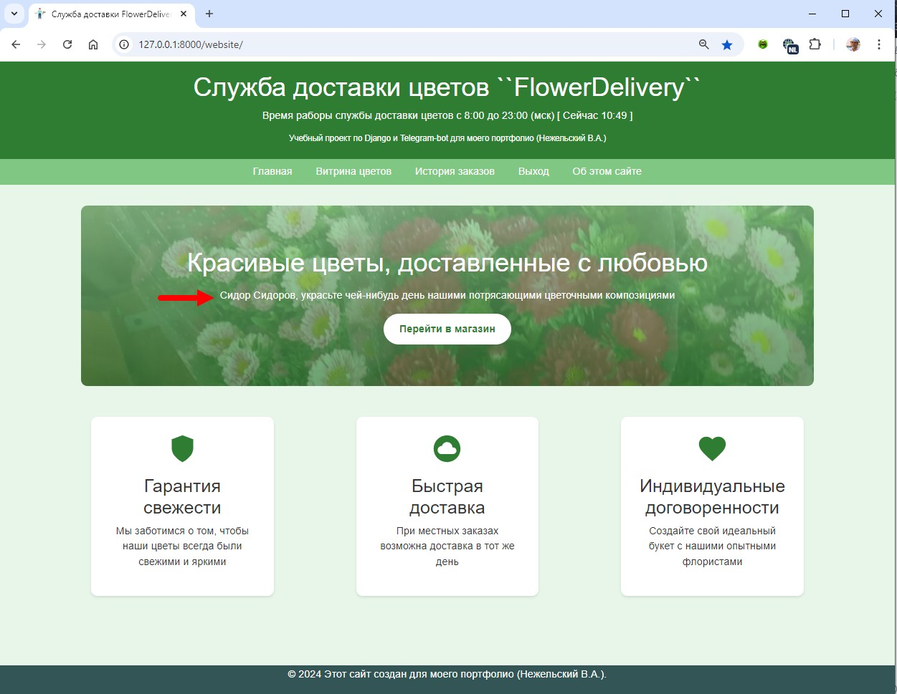
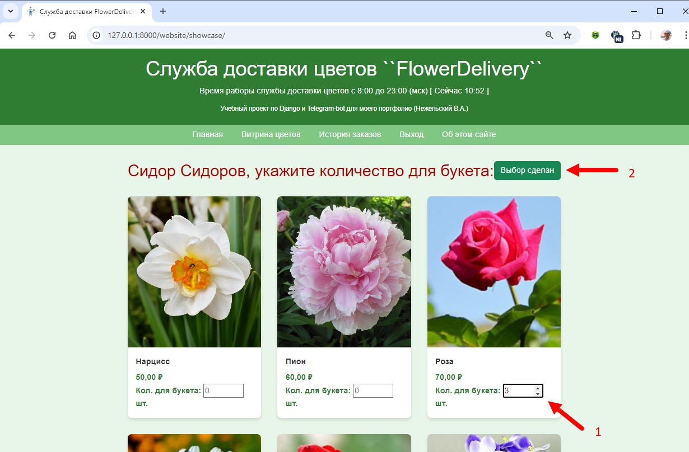
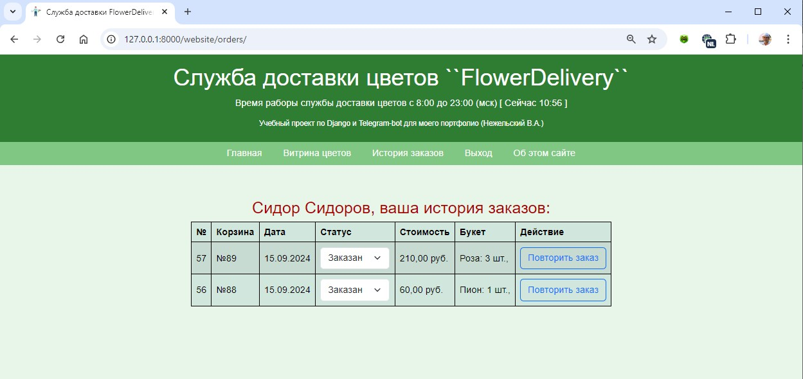
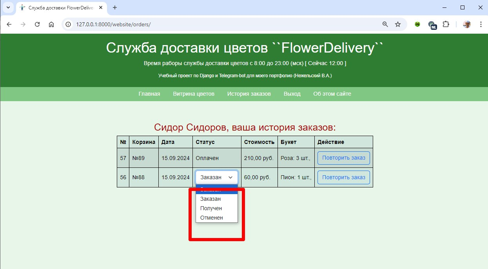
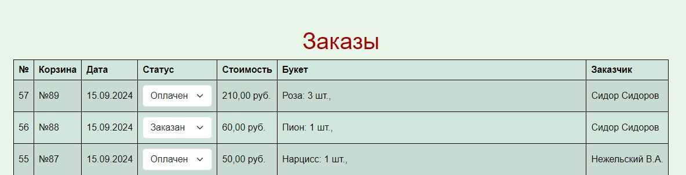
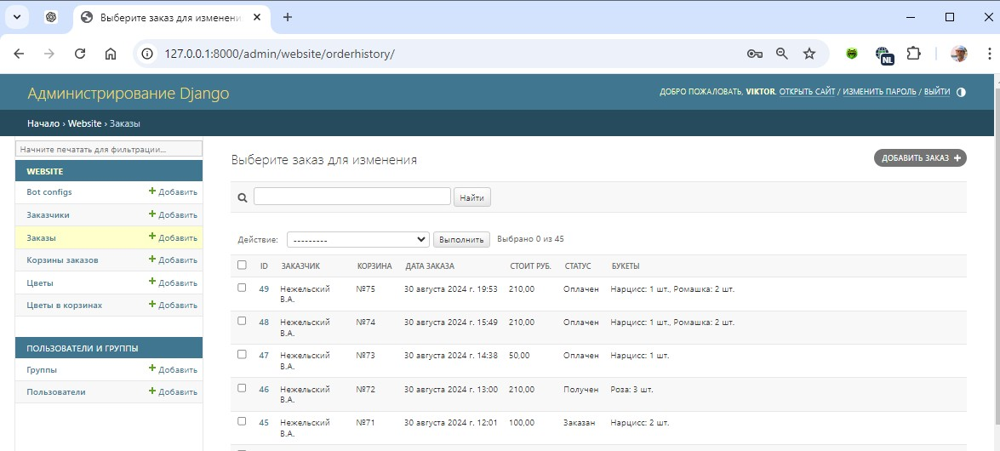
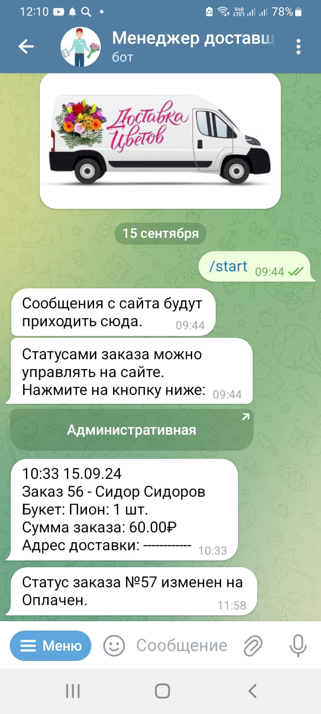
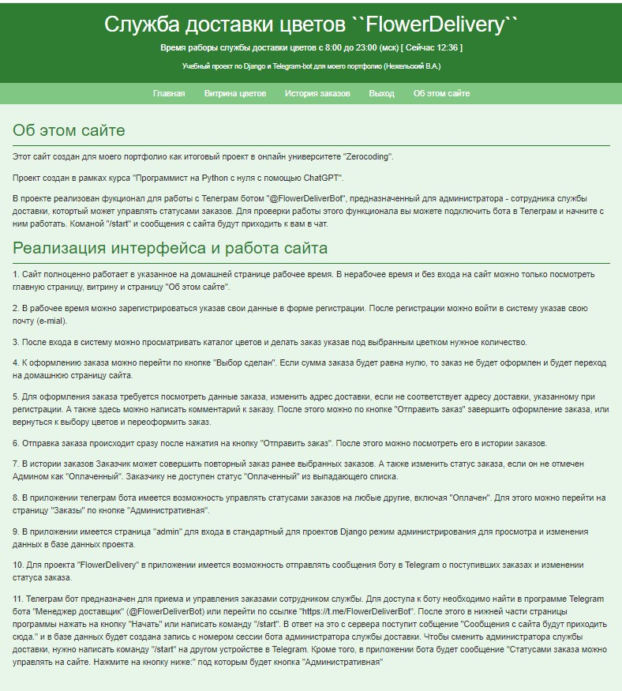

# FlowerDelivery Advanced 
## Итоговый проект

### Техническое задание:
Сайт с доставкой цветов и получение заказов через Telegram бота
### Цель проекта:
#### Цель проекта:
Создание веб-сайта для заказа доставки цветов с расширенной интеграцией заказов через Telegram бота.
#### Общая информация о проекте:
Проект включает разработку веб-сайта для заказа цветов и продвинутого Telegram бота для приема и управления заказами.
### Область применения
#### Описание проблемы:
Необходимость удобного и быстрого способа заказа цветов через интернет и мессенджер.
#### Пользователи системы:
Частные лица и компании.
#### Основные ограничения и допущения:
Пользователи должны иметь доступ к интернету и Telegram. Заказы принимаются только в рабочее время.
#### Функциональные требования
- Веб-сайт:
    - Регистрация и авторизация пользователей.
    - Просмотр каталога цветов.
    - Выбор цветов и добавление в корзину.
    - Оформление заказа с указанием данных для доставки.
    - Просмотр истории заказов.
    - Аккаунт администратора для отметки статуса заказа
    - Возможность повторного заказа, той же позиции из каталога.
- Telegram бот:
    - Получение заказов с информацией о букетах и доставке.
    - Уведомления о статусе заказа.
#### Общая архитектура системы:
- Веб-приложение на Django.
- Серверная часть на Python с использованием Django.
#### Описание подсистем и модулей:
- Модуль регистрации и авторизации.
- Модуль каталога товаров.
- Модуль оформления заказа.
- Модуль управления заказами.
#### Модель данных:
- Таблица пользователей (ID, имя, email, телефон, адрес).
- Таблица товаров (ID, название, цена, изображение).
- Таблица заказов (ID, пользователь, товары, статус, дата заказа).
#### Методы и стратегии тестирования:
- Юнит-тестирование.
- Интеграционное тестирование.

## Реализация технического задания
- Проект реализоват под именем [FlowerDelivery](FlowerDelivery)
- В проекте реализовано приложение [website](website/)
- Взаимодействие с Telegram ботом организовано посредством отправления сообщений.
Реализация взаимодействия находится в пакете [telebot](website/telebot).
Файл config.py содержит значение токена бота. 

### Структура базы данных [models.py](website/models.py)

| Customer              'Заказчики'                  |
|----------------------------------------------------|
| <strong>ID</strong>                                |
| <strong>name</strong> "Имя"                        |
| <strong>emali</strong> "Электронная почта"         |
| <strong>phon</strong> "Телефон"                    |
| <strong>delivery_address</strong> "Адрес доставки" |

| Product           'Цветы'            |
|--------------------------------------|
| <strong>ID</strong>                  |
| <strong>name</strong> "Цветок"       |
| <strong>pice</strong> "Цена"         |
| <strong>image</strong> "Изображение" |

| Cart         'Корзины заказов'            |
|-------------------------------------------|
| <strong>ID</strong>                       |
| <strong>customer</strong> "Заказчик"      |
| <strong>delivery_address</strong> "Адрес" |
| <strong>comment</strong> "Комментарии"    |
| <strong>total_price</strong> "Стоимость"  |
| <strong>created_at</strong> "Дата"        |

| CartItem       'Цветы в корзинах'           |
|---------------------------------------------|
| <strong>ID</strong>                         |
| <strong>cart</strong> "Корзина"             |
| <strong>product</strong> "Цветок в корзине" |
| <strong>quantity</strong> "Количество"      |

| OrderHistory     'Заказы'                 |
|-------------------------------------------|
| <strong>ID</strong>                       |
| <strong>cart</strong> "Корзина"           |
| <strong>order_date</strong> "Дата заказа" |
| <strong>cart_price</strong> "Стоит руб."  |
| <strong>status</strong> "Статус"          |

### Реализация интерфейса и работа сайта
#### Домашняя страница в рабочее время

1. Сайт полноценно работает в указанное на домашней странице рабочее время.
В нерабочее время и без входа на сайт можно только посмотреть 
главную страницу, витрину и страницу "Об этом сайте".
#### Домашняя страница в нерабочее время

#### Страница витрины цветов в режиме Витрина

2. В рабочее время можно зарегистрироваться указав свои данные в 
форме регистрации. После регистрации можно войти в систему указав свою 
почту (e-mial).
#### Страница входа и регистрации

#### Домашняя страница после входа

3. После входа в систему можно просматривать каталог цветов и делать заказ
указав под выбранным цветком нужное количество. 
#### Страница католога в режиме выбора для заказа

4. К оформлению заказа можно перейти по кнопке "Выбор сделан". Если сумма
заказа будет равна нулю, то заказ не будет оформлен и будет переход на
домашнюю страницу сайта. 
5. Для оформления заказа требуется посмотреть данные заказа, изменить
адрес доставки, если не соответствует адресу доставки, указанному при
регистрации. А также здесь можно написать комментарий к заказу. После
этого можно по кнопке "Отправить заказ" завершить оформление заказа,
или вернуться к выбору цветов и переоформить заказ.
#### Страница оформления заказа

6. Отправка заказа происходит сразу после нажатия на кнопку "Отправить
заказ". После этого можно посмотреть его в истории заказов.
#### Страница истории заказов заказчика

7. В истории заказов Заказчик может совершить повторный заказ ранее
выбранных заказов. А также изменить статус заказа, если он не отмечен
Админом как "Оплаченный". Заказчику не доступен статус "Оплаченный" из
выпадающего списка. 

8. В приложении телеграм бота имеется возможность управлять статусами 
заказов на любые другие, включая "Оплачен". Для этого можно перейти на
страницу "Заказы" по кнопке "Административная".
#### Страница заказов для Администратора

9. В приложении имеется страница "admin" для входа в стандартный
для проектов Django режим администрирования для просмотра и изменения
данных в базе данных проекта.
#### Страница в режиме администрирования сайта

10. Для проекта "FlowerDelivery" в приложении имеется возможность
отправлять сообщения боту в Telegram о поступивших заказах и изменении
статуса заказа.
#### Чат Telegram бота для приема заказа службой доставки

11. Телеграм бот предназначен для приема и управления заказами сотрудником службы. 
Для доступа к боту необходимо найти в программе Telegram бота "Менеджер 
доставщик" (@FlowerDeliverBot) или перейти по ссылке 
"https://t.me/FlowerDeliverBot". После этого в нижней части страницы
программы нажать на кнопку "Начать" или написать команду "/start".
В ответ на это с сервера поступит собщение "Сообщения с сайта будут 
приходить сюда." и в базе данных будет создана запись с номером сессии
бота пользователя службы доставки. Чтобы сменить пользователя службы
доставки, нужно написать команду "/start" на другом устройстве в 
Telegram. Кроме того, в приложении бота будет сообщение 
"Cтатусами заказа можно управлять на сайте. Нажмите на кнопку ниже:"
под которым будет кнопка "Административная". 
12. Страница "Об этом сайте"
. 
